# School_Distric_Analysis

A school board employee has given us the following tasks to analyise a set of data in a school district with a school that is suspected of altering testing data. The suspect data will be removed, specifically the Math and Reading test scores for the 9th graders at Thomas High School, and the impact on the overall data will be analysed. The school board asked for the data to be removed and analyzed again for a comparison. 

## Results

Due to potential academic dishonesty by the ninth grade students of Thomas High School, this analysis was conducted twice. The first trial of this analysis included the full set of student data. In the second trial of this analysis, the ninth grade students of Thomas High School had their scores omitted from the calculations. The entire ninth grade class of Thomas High School have had their scores replaced with NaN. The DataFrame below is a summary representing the District after replacing the ninth graders' scores with NaN.

1. How is the district summary affected?

   - The modified summary shows that the Average Math stayede the same, the Average Reading Score increase, the percentage of students Passing Math decrease, the percentage of students Passing Reading decreased and the percentage of students passing both Math and Reading decreased. The adjusted summary is the lower graphic, and the original is the upper graphic.
   
Original

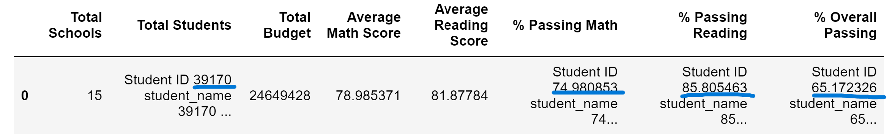

Updated

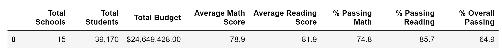

2. How is the school summary affected?

  - The modified summary shows that with-in Thomas High School, the Average Math Score decreased, the Average Reading Score decreased, the percentage of students Passing Math decreased, the percentage of students Passing Reading decreased, and the percentage of students Passing both Math and Reading decreased. The adjusted summary is the lower graphic, and the original is the upper graphic.

Original

Updated

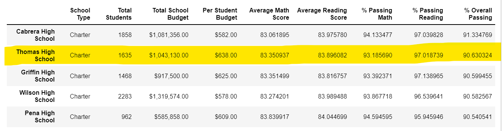

3. How does replacing the ninth graders’ math and reading scores affect Thomas High School’s performance relative to the other schools?

In the original picture, Thomas High School ranked 2nd in the district, raising red flags with the school board.

Original

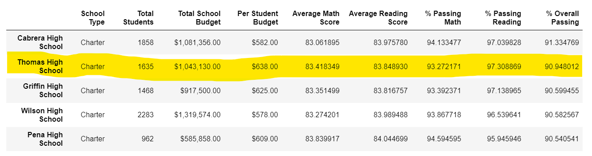

After adjusting the 9th grade data, Thomas High School ranked was not in2nd place anymore.

Updated

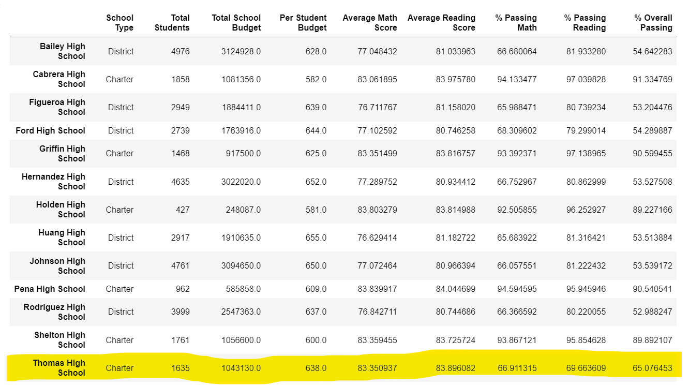

4. How does replacing the ninth-grade scores affect the following:

   - Math and reading scores by grade

      -- Math Score
      
 Original
 
 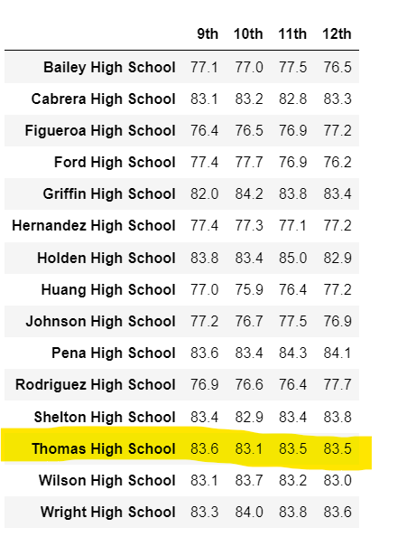
 
 Updated
 
 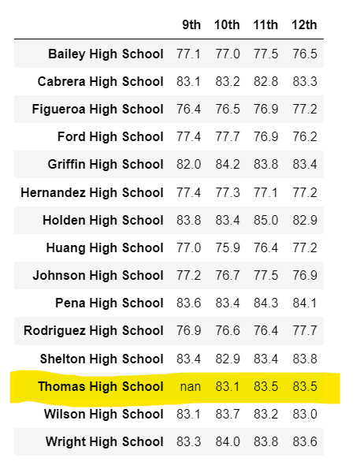
      
      - - Reading Score
      
 Original
 
 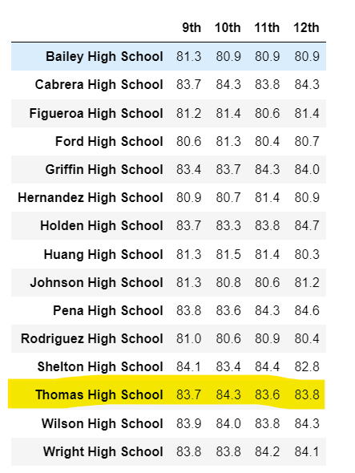
 
 Updated
 
 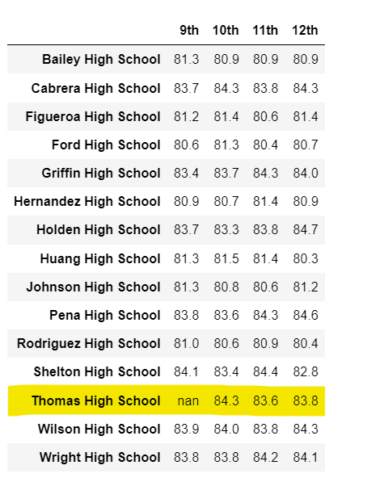

   - Scores by school spending

Thomas High School falls in the $630-$644/student spending range. However, the hundredths place was needed to see the nominal changes.

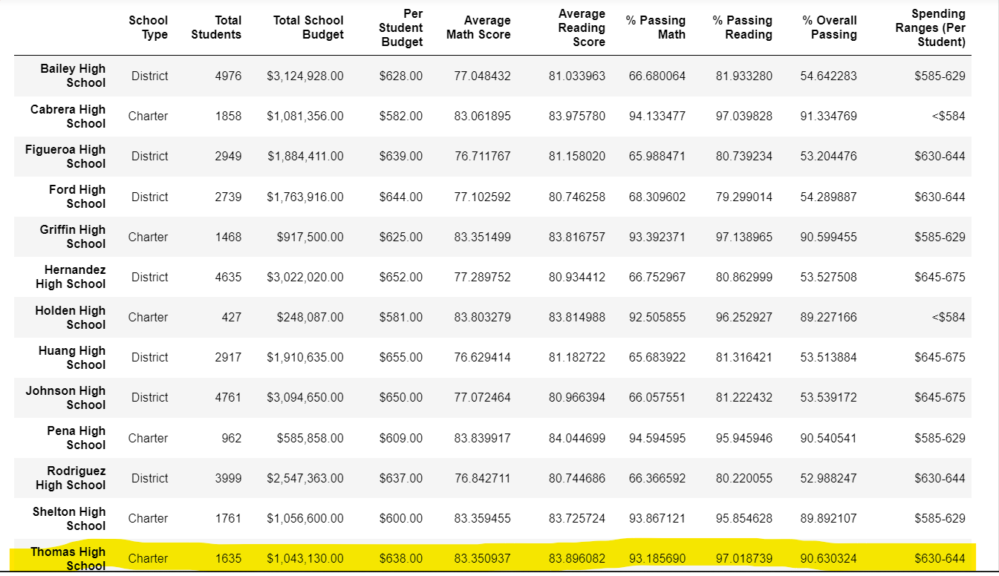

Original

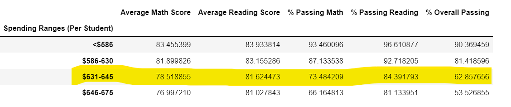

Updated

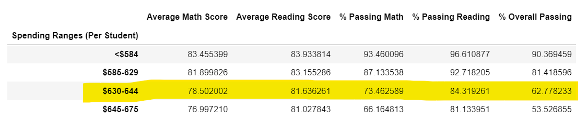

   - Scores by school size

Thomas High School is defined as a medium size school. The hundredths place was needed to see the nominal changes.

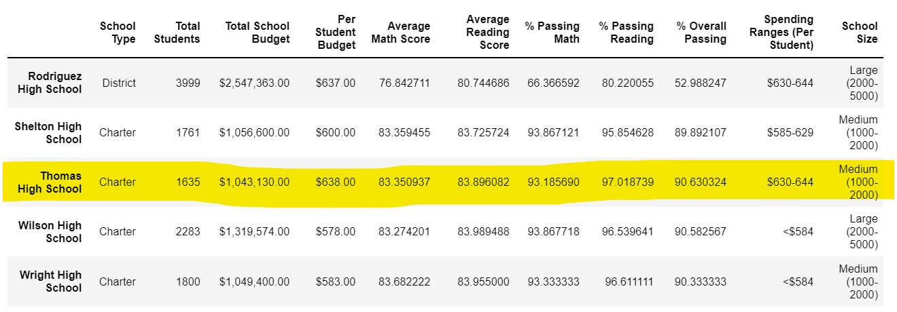

Original

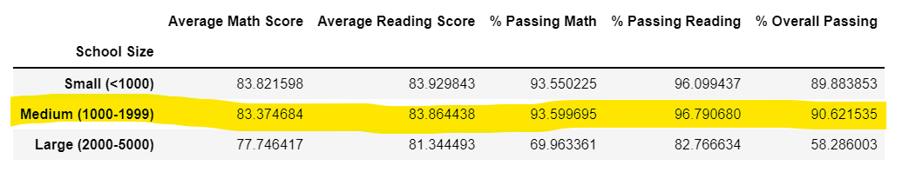

Updated

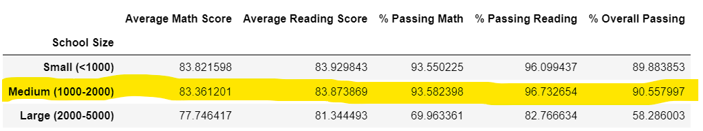

   - Scores by school type

Thomas High School is a charter school type. The hundredths place was needed to see the nominal changes.

Original

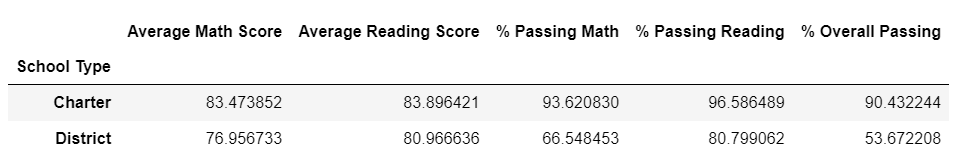

Updated

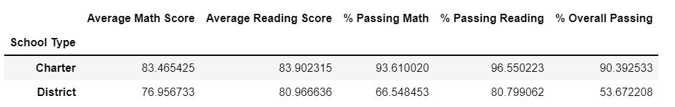

## Summary

1. District Analysis - changes to all scores by less than 0.5 percentage points (or change by less than 0.5%) - no impact to school or student count.
2. The overall passing rate for Thomas High School changed dramatically from 91% to 65%.
3. Thomas High School's ranking dropped from 2nd to 13th in the district of 15 campuses.
4. Scores by School Type - chages to Charter type grouping for all scores by less than 0.4 percentage points (or change by less than 0.4%).
